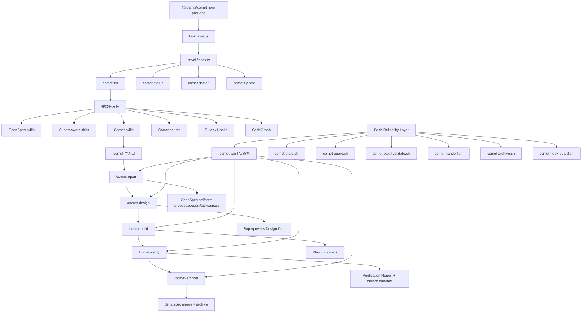
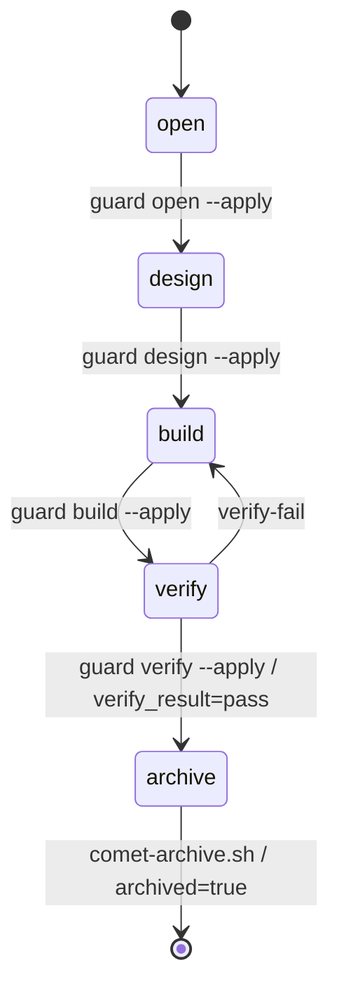

# Comet 项目技术架构交接文档（给后续 Agent）

> 目标读者：另一个需要快速理解、继续分析或复刻 `https://github.com/rpamis/comet` 的 Agent。  
> 阅读目标：先建立整体架构，再按模块进入源码，避免重复通读全部仓库。  
> 分析基准：基于本轮会话已完成的仓库源码与 README 分析结果。若仓库后续更新，请先刷新 README、`assets/manifest.json`、`src/core/*`、`assets/skills/*/SKILL.md` 与核心 shell scripts。

---

## 0. 最短结论

Comet 是一个 **AI Coding Workflow Harness（AI 编程流程编排器）**，不是传统业务应用。

它把：

- **OpenSpec**：负责 **WHAT**，即需求、变更、规格、验收、归档；
- **Superpowers**：负责 **HOW**，即技术设计、计划、TDD、执行、代码审查、收尾；
- **Comet**：负责 **ORCHESTRATION**，即阶段路由、状态管理、Guard 校验、Handoff 上下文交接、Hook 防漂移、跨平台安装。

组合成：

```text
/comet
  ↓ auto-detect
/comet-open
  ↓
/comet-design
  ↓
/comet-build
  ↓
/comet-verify
  ↓
/comet-archive
```

一句话概括：

> Comet 用 TypeScript CLI 做跨平台安装与分发，用 Markdown Skill 做 Agent 工作流编排，用 Bash 脚本做状态机、阶段守卫、上下文交接和归档闭环。

---

## 1. 推荐阅读顺序

后续 Agent 不建议从头通读仓库。建议按以下顺序读取：

| 顺序 | 文件 / 目录 | 读取目的 |
|---:|---|---|
| 1 | `README.md` | 建立项目定位、五阶段流程、状态文件、脚本列表 |
| 2 | `assets/manifest.json` | 理解安装清单：Skills、scripts、rules、hooks、语言包 |
| 3 | `src/cli/index.ts` | 理解 CLI command 注册方式 |
| 4 | `src/commands/init.ts` | 理解初始化安装主流程 |
| 5 | `src/core/platforms.ts` | 理解多平台适配模型 |
| 6 | `src/core/detect.ts` | 理解平台和已有技能检测 |
| 7 | `src/core/skills.ts` | 理解 Skill / Rule / Hook 如何复制到平台目录 |
| 8 | `src/core/openspec.ts` | 理解 OpenSpec 安装与 profile 初始化 |
| 9 | `src/core/superpowers.ts` | 理解 Superpowers 安装与 agent 映射 |
| 10 | `assets/skills/comet/SKILL.md` | 理解 `/comet` 主入口如何自动路由 |
| 11 | `assets/skills/comet-open/SKILL.md` | 理解 Phase 1：需求打开 |
| 12 | `assets/skills/comet-design/SKILL.md` | 理解 Phase 2：深度设计与 Handoff |
| 13 | `assets/skills/comet-build/SKILL.md` | 理解 Phase 3：计划、执行模式、TDD、子代理 |
| 14 | `assets/skills/comet-verify/SKILL.md` | 理解 Phase 4：验证、分支处理、报告 |
| 15 | `assets/skills/comet-archive/SKILL.md` | 理解 Phase 5：归档闭环 |
| 16 | `assets/skills/comet/scripts/comet-state.sh` | 理解状态机实现 |
| 17 | `assets/skills/comet/scripts/comet-guard.sh` | 理解阶段出口检查 |
| 18 | `assets/skills/comet/scripts/comet-handoff.sh` | 理解上下文包与 hash |
| 19 | `assets/skills/comet/scripts/comet-archive.sh` | 理解自动归档流程 |
| 20 | `assets/skills/comet/scripts/comet-hook-guard.sh` | 理解 PreToolUse 写入拦截 |

---

## 2. 总体架构



---

## 3. 分层架构说明

### 3.1 TypeScript CLI 安装与分发层

**职责：**

- 提供 `comet init/status/doctor/update` 命令；
- 识别用户当前项目已配置哪些 AI coding platforms；
- 安装 OpenSpec / Superpowers / Comet Skills；
- 分发 Comet scripts、rules、hooks；
- 创建 `docs/superpowers/specs/` 与 `docs/superpowers/plans/` 工作目录；
- 可选安装 CodeGraph。

**核心文件：**

```text
package.json
bin/comet.js
src/cli/index.ts
src/commands/init.ts
src/commands/status.ts
src/commands/doctor.ts
src/commands/update.ts
```

**实现要点：**

- `package.json` 中 `bin.comet = ./bin/comet.js`。
- `bin/comet.js` 只导入 `../dist/cli/index.js`。
- `src/cli/index.ts` 用 `commander` 注册命令。
- `initCommand()` 是安装主流程，负责：
  1. 选择 scope：project / global；
  2. 选择 Skill 语言：English / 中文；
  3. 选择目标平台；
  4. 检测已有 OpenSpec / Superpowers / Comet；
  5. 决定 overwrite / skip / install；
  6. 调用 OpenSpec 与 Superpowers 安装逻辑；
  7. 复制 Comet Skills、Rules、Hooks；
  8. 可选安装 CodeGraph；
  9. 创建工作目录。

---

### 3.2 Platform Adapter 多平台适配层

**职责：**把平台差异集中为配置，而不是写死在流程中。

**核心文件：**

```text
src/core/platforms.ts
src/core/detect.ts
src/core/superpowers.ts
src/core/openspec.ts
```

**关键抽象：**

```ts
interface Platform {
  id: string;
  name: string;
  skillsDir: string;
  globalSkillsDir?: string;
  detectionPaths?: string[];
  openspecToolId: string;
  rulesDir?: string;
  rulesBaseDir?: string;
  rulesFormat?: 'md' | 'mdc' | 'copilot';
  supportsHooks?: boolean;
  hookFormat?: ...;
}
```

**设计价值：**

- 新增平台时，优先改 `PLATFORMS` 表；
- OpenSpec tool id、Skill 目录、global 目录、rules 格式、hooks 格式全部通过配置描述；
- Superpowers 安装通过 `SKILLS_AGENT_MAP` 把 Comet 平台 id 映射到 `skills` CLI 的 agent 名称。

---

### 3.3 Manifest 驱动分发层

**核心文件：**

```text
assets/manifest.json
src/core/skills.ts
```

**Manifest 声明内容：**

```text
skills:
  comet/SKILL.md
  comet-open/SKILL.md
  comet-design/SKILL.md
  comet-build/SKILL.md
  comet-verify/SKILL.md
  comet-archive/SKILL.md
  comet-hotfix/SKILL.md
  comet-tweak/SKILL.md
  comet/scripts/*.sh

rules:
  comet/rules/comet-phase-guard.md

hooks:
  comet/scripts/comet-hook-guard.sh
  matcher: Write|Edit

languages:
  skills
  skills-zh
```

**实现要点：**

- `copyCometSkillsForPlatform()` 读取 manifest 并复制 Skill 文件；
- 脚本始终从英文 `assets/skills` 复制；
- 普通 Skill 根据用户选择从 `skills` 或 `skills-zh` 复制；
- OpenCode 有特殊逻辑：将 Skill 转换成 command markdown；
- Rule 会根据平台格式转换：
  - `md`：普通 markdown；
  - `mdc`：Cursor MDC frontmatter；
  - `copilot`：GitHub Copilot instructions 格式；
- Hook 会按平台 hookFormat 写入不同配置文件。

---

## 4. Skill 编排层

### 4.1 `/comet` 主入口

**职责：**自动检测当前状态并路由到正确阶段。

它的决策依据：

```text
openspec list --json
openspec/changes/<name>/.comet.yaml
tasks.md 是否完成
Design Doc 是否存在
Plan 是否存在
verify_result
archived
workflow 类型：full / hotfix / tweak
```

**核心逻辑：**

```text
1. 如果 archived=true 或 change 已移入 archive → 完成
2. 如果 verify_result=pass 且未 archive → /comet-archive
3. 如果 verify_result=fail → 停在失败决策点
4. 如果 phase=verify 或 tasks.md 全部完成 → /comet-verify
5. 如果 phase=build 或已有 Design Doc → /comet-build
6. 如果 phase=design 或尚无 Design Doc → /comet-design
7. 如果 phase=open 或 .comet.yaml 缺失 → /comet-open
8. 没有 active change → /comet-open
```

**重要原则：**

- 不信任对话历史；
- 每次恢复都重新读文件状态；
- 文件状态与 `.comet.yaml` 冲突时，用可验证文件状态纠正状态；
- preset detection 优先：hotfix / tweak 可绕开完整流程。

---

### 4.2 五阶段 Skill

| Phase | Skill | Owner | 核心产物 |
|---|---|---|---|
| 1. Open | `/comet-open` | OpenSpec | `proposal.md`, `design.md`, `tasks.md`, `.comet.yaml` |
| 2. Design | `/comet-design` | Superpowers | Design Doc, handoff context, spec patch |
| 3. Build | `/comet-build` | Superpowers | Plan, code commits, task checkoff |
| 4. Verify | `/comet-verify` | Both | Verification Report, branch handling |
| 5. Archive | `/comet-archive` | OpenSpec | delta → main spec merge, archive dir |

---

## 5. 状态机架构

### 5.1 状态文件职责拆分

| 文件 | Owner | 作用 |
|---|---|---|
| `.openspec.yaml` | OpenSpec | Spec 生命周期与 change 元数据 |
| `.comet.yaml` | Comet | 工作流阶段、执行模式、验证状态、归档状态 |

### 5.2 `.comet.yaml` 关键字段

```yaml
workflow: full
phase: build
context_compression: off
auto_transition: true

design_doc: docs/superpowers/specs/YYYY-MM-DD-topic-design.md
plan: docs/superpowers/plans/YYYY-MM-DD-feature.md

build_mode: subagent-driven-development
build_pause: null
subagent_dispatch: confirmed
tdd_mode: tdd
isolation: branch

verify_mode: full
verify_result: pending
verification_report: null
branch_status: pending

handoff_context: openspec/changes/<name>/.comet/handoff/design-context.json
handoff_hash: <sha256>

created_at: YYYY-MM-DD
verified_at: null
archived: false
```

### 5.3 状态转移



### 5.4 状态操作原则

**不要让 Agent 手动编辑复杂状态。**

应通过：

```bash
comet-state.sh init <change> <workflow>
comet-state.sh get <change> <field>
comet-state.sh set <change> <field> <value>
comet-state.sh transition <change> <event>
comet-state.sh check <change> <phase>
comet-state.sh next <change>
comet-state.sh scale <change>
```

---

## 6. 可靠性控制层

### 6.1 `comet-state.sh`

**职责：**统一 `.comet.yaml` 读写、初始化、检查、状态转移、恢复上下文、规模评估。

重点能力：

- 校验 change name，防 path traversal；
- 初始化 `.comet.yaml`；
- 限制字段枚举值；
- `check` 校验 phase entry requirements；
- `transition` 执行受控状态转移；
- `next` 决定是否自动调用下一 Skill；
- `scale` 根据任务数、delta spec 数、文件数决定 light/full verify。

---

### 6.2 `comet-guard.sh`

**职责：**阶段出口检查与 `--apply` 自动推进。

典型检查：

| Phase | Guard 检查 |
|---|---|
| open | `proposal.md`, `design.md`, `tasks.md` 存在且完整 |
| design | Design Doc 存在；handoff context/hash 存在并匹配 |
| build | tasks 完成；plan tasks 完成；build_mode/isolation/tdd_mode 合法；build 通过 |
| verify | verification_report 存在；branch_status=handled |
| archive | verify_result=pass；archived=false |

**核心理念：**

> Agent 说“完成”不算，Guard 检查通过才算。

---

### 6.3 `comet-yaml-validate.sh`

**职责：**校验 `.comet.yaml` schema。

检查内容：

- required fields；
- enum values；
- path fields 是否存在；
- handoff_hash 是否为 64 位 sha256；
- unknown fields 警告。

---

### 6.4 `comet-hook-guard.sh`

**职责：**PreToolUse hook，拦截 `Write|Edit`。

关键规则：

```text
open/design/archive 阶段：
  - 阻止源代码写入
  - 只允许对应文档、状态、handoff、spec 等白名单路径

build/verify 阶段：
  - 允许代码写入
```

**价值：**

Prompt 约束不可靠，Hook 可以把“不要在错误阶段写代码”变成可执行规则。

---

## 7. Handoff 与上下文压缩

### 7.1 为什么需要 Handoff

OpenSpec 负责 WHAT，Superpowers 负责 HOW。Design 阶段需要把 OpenSpec 的 proposal/design/tasks/specs 转成 Superpowers 可读的上下文包。

Comet 禁止 Agent 临场手写总结，要求脚本生成：

```bash
comet-handoff.sh <change-name> design --write
```

### 7.2 默认模式

生成：

```text
openspec/changes/<name>/.comet/handoff/design-context.json
openspec/changes/<name>/.comet/handoff/design-context.md
```

内容包含：

- change name；
- phase；
- mode；
- canonical_spec；
- source file paths；
- source file SHA256；
- deterministic excerpts；
- context_hash。

### 7.3 Beta context compression

当 `context_compression: beta` 时，生成：

```text
spec-context.json
spec-context.md
```

特点：

- delta spec verbatim projection；
- proposal/design/tasks 作为 supporting artifacts，以 hash 引用；
- 目标是降低 Build 阶段 token 输入；
- OpenSpec 原始文件仍是 canonical source of truth。

### 7.4 Hash 用途

`.comet.yaml` 记录：

```yaml
handoff_context: ...
handoff_hash: ...
```

Verify 或后续阶段可重新计算 hash 判断：

```text
OpenSpec artifacts 是否自 Design 阶段以来发生变化？
```

---

## 8. 五阶段实现拆解

### 8.1 Phase 1：Open

**目标：**把用户想法变成 OpenSpec change。

核心步骤：

```text
1. 加载 openspec-explore
2. 澄清需求
3. 如 PRD 太大，先做 split preflight
4. 用户确认需求澄清完成
5. 加载 openspec-new-change
6. 创建 change skeleton
7. 创建 .comet.yaml
8. 检查 proposal/design/tasks 完整
9. 用户确认 artifacts
10. guard open --apply
```

关键产物：

```text
openspec/changes/<name>/
  .openspec.yaml
  .comet.yaml
  proposal.md
  design.md
  tasks.md
```

注意：

- 不要直接调用 `/opsx:new` 替代 `/comet-open`；
- `/comet-open` 负责同时初始化 OpenSpec artifact 和 Comet state；
- 大 PRD 可拆成多个 independent changes。

---

### 8.2 Phase 2：Design

**目标：**把 OpenSpec 的 WHAT 转成 Superpowers 的技术设计 HOW。

核心步骤：

```text
1. comet-state check <name> design
2. comet-handoff.sh <name> design --write
3. 加载 Superpowers brainstorming
4. 基于 handoff 做深度技术设计
5. 用户确认设计方案
6. 写 brainstorm-summary.md
7. 可触发 context compaction
8. 创建 Design Doc
9. 如有 spec patch，更新 delta spec 并重新生成 handoff
10. comet-state set design_doc ...
11. guard design --apply
```

关键产物：

```text
docs/superpowers/specs/YYYY-MM-DD-<topic>-design.md
openspec/changes/<name>/.comet/handoff/design-context.md
openspec/changes/<name>/.comet/handoff/design-context.json
openspec/changes/<name>/.comet/handoff/brainstorm-summary.md
```

注意：

- Design Doc frontmatter 要最小化；
- OpenSpec delta spec 仍是 canonical spec；
- Design Doc 不应变成第二份需求规格；
- Spec Patch 只能补验收场景、边界、歧义修正，不能私自改 scope。

---

### 8.3 Phase 3：Build

**目标：**生成实施计划，并按用户确认的执行模式实现。

核心步骤：

```text
1. comet-state check <name> build
2. 用 writing-plans 生成 Plan
3. 记录 plan path
4. plan-ready pause：用户可选择继续或暂停换模型
5. 用户选择 workspace isolation：branch / worktree
6. 用户选择 execution method：
   - executing-plans
   - subagent-driven-development
   - direct（full workflow 需 direct_override）
7. 用户选择 TDD mode：tdd / direct
8. 执行 branch 或 worktree 隔离
9. 按 build_mode 加载对应 Superpowers Skill
10. 每个任务完成后：
    - 更新 Plan task
    - 更新 OpenSpec tasks.md
    - commit
11. executing-plans 模式结束前请求 code review
12. 遇到 crash/test failure/build failure 加载 systematic-debugging
13. guard build --apply
```

关键状态字段：

```yaml
plan: ...
build_pause: null | plan-ready
isolation: branch | worktree
build_mode: executing-plans | subagent-driven-development | direct
subagent_dispatch: null | confirmed
tdd_mode: tdd | direct
direct_override: true | false
```

注意：

- full workflow 不能默认 `build_mode: direct`；
- `subagent-driven-development` 必须确认平台有真实后台子代理能力；
- `tdd_mode: tdd` 时必须先写失败测试；
- tasks.md 和 Plan 都要持久 checkoff，不要只更新聊天 Todo。

---

### 8.4 Phase 4：Verify

**目标：**证明实现满足需求和设计，并完成 branch handling。

核心步骤：

```text
1. comet-state check <name> verify
2. comet-state scale <name>
3. 根据 scale 决定 verify_mode：light / full
4. 处理 dirty worktree
5. 加载 verification-before-completion
6. light verify：
   - tasks done
   - changed files match tasks
   - build passes
   - related tests pass
   - no obvious security issue
7. full verify：
   - 加载 openspec-verify-change
   - 检查 proposal/design/delta spec/design doc/implementation consistency
8. 若失败：
   - 停在用户决策点
   - 用户选择 fix 后 transition verify-fail 回 build
9. 加载 finishing-a-development-branch
10. 用户选择 branch handling
11. 写 verification report
12. set verification_report
13. set branch_status handled
14. guard verify --apply
```

关键产物：

```text
docs/superpowers/reports/YYYY-MM-DD-<change-name>-verify.md
```

通过条件：

```yaml
verify_result: pass
verification_report: <existing file>
branch_status: handled
phase: archive
```

注意：

- 有 CRITICAL failure 时不能直接接受偏差；
- verify-fail 不能由 Agent 自动决定，必须用户确认；
- 连续失败超过阈值后必须再次询问用户是否继续修复。

---

### 8.5 Phase 5：Archive

**目标：**把 delta spec 合并回 main spec，并关闭生命周期。

核心步骤：

```text
1. comet-state check <name> archive
2. 用户最终确认 archive
3. 运行 comet-archive.sh <change-name>
4. 验证 entry state：
   - phase=archive
   - verify_result=pass
   - archived=false
5. 标注 Design Doc frontmatter
6. 标注 Plan frontmatter
7. 调用 openspec archive
8. 检查 main spec 没有 delta-only heading 泄漏
9. transition archived
10. change 移动到 archive 目录
```

归档后结构：

```text
openspec/changes/archive/YYYY-MM-DD-<change-name>/
  .comet.yaml  # archived: true
  proposal.md
  design.md
  tasks.md
  specs/
```

注意：

- Archive 成功后不要再对旧 active change 路径运行 guard；
- archive 完成依据是脚本 exit code 和 archived directory state。

---

## 9. Preset 路径

### 9.1 `/comet-hotfix`

适合快速 bug fix。

特征：

```text
open → build → verify → archive
跳过 brainstorming
build_mode 默认 direct
isolation 默认 branch
verify_mode 默认 light
```

升级到 full 的条件示例：

```text
涉及 3+ 文件
架构变化
数据库 schema 变化
新增 public API
超出单函数/模块范围
```

### 9.2 `/comet-tweak`

适合文案、配置值、小型 prompt/docs 调整。

特征：

```text
open → lightweight build → light verify → archive
跳过 brainstorming 和完整 plan
```

升级到 full 的条件示例：

```text
涉及 5+ 文件
跨模块协调
需要 5+ 新测试
新增/删除配置项
影响 existing spec
```

---

## 10. CodeGraph 集成

**核心文件：**

```text
src/core/codegraph.ts
```

**职责：**

- 检查 `codegraph` CLI；
- 不存在则安装 `@colbymchenry/codegraph`；
- 对支持的平台运行：

```bash
codegraph install --target=<targets> --location=<local|global> --yes
```

- project scope 下再运行：

```bash
codegraph init -i
```

**支持平台示例：**

```text
claude
cursor
codex
opencode
gemini
kiro
antigravity
```

**架构作用：**

减少 Agent 对大型代码库的重复搜索和读取成本。

---

## 11. Agent 继续分析时的注意事项

### 11.1 不要误判 Comet 的主价值

Comet 的主价值不是：

```text
生成某种业务代码
```

而是：

```text
为 AI coding 建立可恢复、可验证、可审计的流程基础设施
```

### 11.2 不要只读 README

README 能理解整体，但实现细节在：

```text
assets/skills/*/SKILL.md
assets/skills/comet/scripts/*.sh
src/core/*.ts
```

尤其是 `SKILL.md` 中包含大量 Agent 行为约束，这些约束才是运行时工作流的核心。

### 11.3 区分三类“状态”

```text
OpenSpec state:
  .openspec.yaml

Comet workflow state:
  .comet.yaml

Git / implementation state:
  branch / worktree / commits / dirty worktree
```

三者不能混为一谈。

### 11.4 区分 phase advancement 与 auto transition

- `guard --apply` 总是负责 phase advancement；
- `auto_transition` 只控制是否自动调用下一 Skill；
- 即使 `auto_transition=false`，阶段状态仍然可以被推进。

### 11.5 用户决策点不能自动跳过

以下必须停下来等用户确认：

```text
需求澄清确认
PRD split 确认
Open artifacts 确认
设计方案确认
plan-ready 继续/暂停
isolation/build_mode/tdd_mode 选择
branch name 确认
verify fail 后 fix/accept deviation
branch handling
最终 archive 确认
hotfix/tweak 升级 full workflow
```

---

## 12. 如果要复刻 Comet，建议实现顺序

最小可行版本建议按以下顺序做：

```text
1. 定义状态文件 .comet.yaml
2. 实现 state CLI / shell script
3. 实现 phase guard
4. 编写五阶段 Skill 文档
5. 设计 artifact 目录结构
6. 实现 handoff context pack + hash
7. 实现 archive 脚本
8. 实现 hook guard
9. 最后再实现 TypeScript CLI installer
10. 扩展多平台 adapter
```

优先级不要反过来。先写 installer 但没有状态机和 guard，会变成普通文件复制工具。

---

## 13. 复刻用最小目录模型

```text
project/
├── .comet/config.yaml
├── .platform/skills/
│   ├── comet/SKILL.md
│   ├── comet-open/SKILL.md
│   ├── comet-design/SKILL.md
│   ├── comet-build/SKILL.md
│   ├── comet-verify/SKILL.md
│   ├── comet-archive/SKILL.md
│   └── comet/scripts/
│       ├── comet-state.sh
│       ├── comet-guard.sh
│       ├── comet-handoff.sh
│       ├── comet-archive.sh
│       ├── comet-yaml-validate.sh
│       └── comet-hook-guard.sh
├── openspec/
│   ├── config.yaml
│   └── changes/
│       └── <change>/
│           ├── .openspec.yaml
│           ├── .comet.yaml
│           ├── proposal.md
│           ├── design.md
│           ├── tasks.md
│           └── specs/<capability>/spec.md
└── docs/superpowers/
    ├── specs/
    ├── plans/
    └── reports/
```

---

## 14. 关键设计模式总结

| Pattern | Comet 中的体现 | 学习价值 |
|---|---|---|
| Adapter Pattern | `PLATFORMS`, `SKILLS_AGENT_MAP` | 多平台差异数据化 |
| Manifest-driven Distribution | `assets/manifest.json` | 新增文件只需改清单 |
| State Machine | `.comet.yaml`, `comet-state.sh` | 长任务可恢复 |
| Guarded Transition | `comet-guard.sh --apply` | 阶段推进可验证 |
| Artifact-driven Workflow | proposal/design/tasks/doc/plan/report/archive | 不依赖聊天记忆 |
| Human-in-the-loop | blocking points | 自动化不替代关键判断 |
| Handoff Package | `design-context` / `spec-context` | 跨阶段上下文可追踪 |
| Hook Enforcement | `comet-hook-guard.sh` | 防止 Agent 阶段漂移 |
| Context Compression | `context_compression: beta` | 控制 token 成本 |
| Lifecycle Closure | `comet-archive.sh` | delta spec 合并回 main spec |

---

## 15. 风险点与边界

### 15.1 Bash 解析 YAML 的边界

Comet 使用 `grep/sed/awk` 解析简单顶层 YAML 字段。优点是轻量、跨平台；缺点是不适合复杂 YAML 结构。因此它通过字段约束和 validator 降低风险。

### 15.2 平台能力不一致

不同 AI coding 平台对 Skill、Rule、Hook、Subagent 的支持不一致。Comet 通过 `supportsHooks`、`hookFormat`、`rulesFormat`、`SKILLS_AGENT_MAP` 适配，但后续分析时要确认平台实际行为。

### 15.3 Prompt 约束与脚本约束要区分

Skill 文档中的流程约束由 Agent 执行；Guard/Hook/State 脚本是更强约束。分析可靠性时要优先看脚本层是否真正 enforce。

### 15.4 Archive 后路径变化

归档成功后 active change 被移动到：

```text
openspec/changes/archive/YYYY-MM-DD-<change-name>/
```

旧路径不再存在，不要继续对旧 active path 运行 guard。

---

## 16. 后续 Agent 可直接执行的任务清单

若需要继续深化分析，建议按下面任务推进：

```text
[ ] 画出 comet-state.sh 的完整 transition event 表
[ ] 逐项列出 comet-guard.sh 对 open/design/build/verify/archive 的具体检查函数
[ ] 分析 skills.ts 对不同 hookFormat 的写入差异
[ ] 对比 assets/skills 与 assets/skills-zh 是否完全同步
[ ] 验证 doctor.ts 的 VALID_YAML_FIELDS 是否覆盖最新 .comet.yaml 字段
[ ] 检查 update.ts 是否与 manifest.json 完全一致
[ ] 提取 /comet-hotfix 和 /comet-tweak 的完整升级规则
[ ] 用一个模拟 change 跑通 state init → guard → archive 的 dry-run
[ ] 分析 Windows Git Bash 下 shell scripts 的兼容性
[ ] 输出一份“复刻 Comet 最小实现”设计稿
```

---

## 17. 极简交接提示词

如果要把任务转交给另一个 Agent，可直接使用下面提示词：

```text
你将继续分析 https://github.com/rpamis/comet。

请先不要通读全部源码，按以下顺序读取：
README.md → assets/manifest.json → src/cli/index.ts → src/commands/init.ts → src/core/platforms.ts → src/core/detect.ts → src/core/skills.ts → src/core/openspec.ts → src/core/superpowers.ts → assets/skills/comet/SKILL.md → 五个 phase Skill → comet-state.sh → comet-guard.sh → comet-handoff.sh → comet-archive.sh → comet-hook-guard.sh。

核心判断：
Comet 是 AI Coding Workflow Harness。
OpenSpec 管 WHAT，Superpowers 管 HOW，Comet 管状态、编排、Guard、Handoff、Hook、Archive。
不要只分析 CLI；真正的运行时逻辑主要在 assets/skills/*.md 和 assets/skills/comet/scripts/*.sh。

重点输出：
1. 五阶段流程的状态机；
2. 每阶段 artifact；
3. 每个 Bash script 的 enforce 逻辑；
4. 多平台安装适配；
5. 可复刻的最小实现方案。
```

---

## 18. 相关辅助文件

本轮会话已生成一张架构图文件：

```text
/mnt/data/comet_architecture_diagram.svg
```

如果需要给人类读者展示，可与本文档一起交付。
