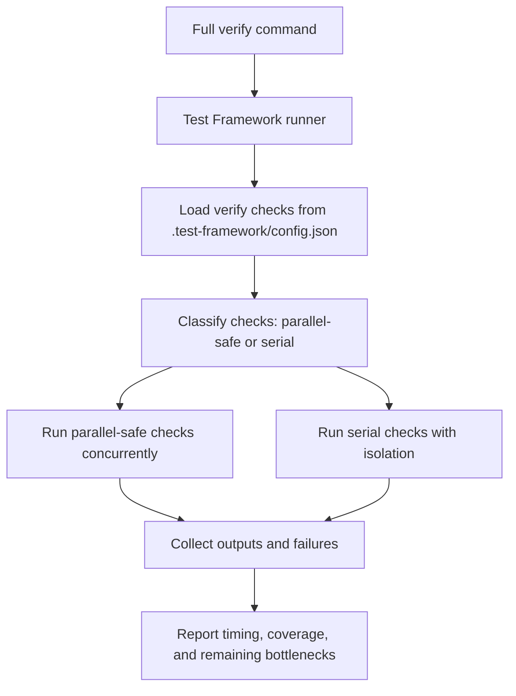

# Full Verification Runtime Design

## Context

Full verification currently takes about 214 seconds on this machine. The largest measured contributor is PR Flow（拉取请求流程） testing, especially repeated Git（版本管理） repository setup, clone（克隆）/push（推送） flows, fake `gh`（模拟 GitHub 命令行工具） process scripts, and Python CLI（Python 命令行程序） startup.

The design target is stricter than making one file faster: full verification（完整验证） must complete in under 60 seconds while preserving behavior coverage across the repository. Both optimization layers apply to the whole configured verification suite, not only `tests/test_pr_flow_cli.py`.

Current canonical full verification command（规范完整验证命令） is `python plugins/test-framework/skills/test-framework/scripts/test_framework.py verify --project . --full`. The plan must re-run this command before and after implementation, and it must cover all configured verify checks（验证检查项） in `.test-framework/config.json`.

`docs/rules/` is out of scope. Test-writing rules for this change stay in OpenSpec（规格流程） artifacts, design notes, tasks, and implementation plan unless the user later confirms another location.

## Goals

- Reduce full verification（完整验证） to under 60 seconds on the local development machine.
- Preserve behavior coverage for local build contract（本地构建契约）, PR Flow（拉取请求流程）, Release Flow（发布流程）, Agent Guard（代理守卫）, cross-agent-review（跨代理审查）, Test Framework（测试框架）, and OpenSpec（开放规格） contracts.
- Apply repo-native optimization to all tests where repeated setup cost exists.
- Add suite-wide parallel execution through the Test Framework（测试框架） runner（运行器）, with safe serial fallback for checks（检查项） that cannot run in parallel.
- Record before/after timing evidence and remaining bottlenecks.

## Non-Goals

- Do not modify files under `docs/rules/`.
- Do not meet the runtime target by deleting coverage, skipping required checks（检查项）, or turning full verification（完整验证） into a marker-filtered（测试标记过滤） subset.
- Do not rely on machine-only fixes such as RAM disk（内存盘）, antivirus exclusion, or operating-system changes as the primary solution.
- Do not change user-facing CLI（命令行界面） behavior for PR Flow（拉取请求流程） or other plugins（插件）.

## Architecture

The solution has two layers.

Layer 1 is repo-native test optimization. Tests should avoid repeating expensive setup when that setup is not the behavior under test. Shared fixture（共享测试夹具） templates, reusable stubs（替身）, in-process（进程内） calls, and narrow test seams（测试接缝） are allowed when they preserve the behavior being checked.

Layer 2 is suite-wide parallel execution. The Test Framework（测试框架） runner（运行器） coordinates full verification（完整验证） across all configured verify checks（验证检查项） in `.test-framework/config.json`. Checks（检查项） that are parallel-safe can run concurrently. Checks（检查项） that are not parallel-safe still run during full verification（完整验证）, but in a serial group.

## Repo-Native Test Rules

These rules are part of this OpenSpec（规格流程） change and should guide implementation work:

- Use real end-to-end（端到端） tests for user-facing workflow confidence, not for every branch in a decision matrix.
- For branch-state, stop-state（停机状态）, review gate（审查门禁）, audit（审计）, and command-contract tests, prefer in-process（进程内） calls or narrow seams（测试接缝） when CLI（命令行界面） parsing and real process behavior are not under test.
- Keep shared Git（版本管理） fixtures（测试夹具） immutable. If a test mutates state, copy from a template or create an isolated worktree（工作树）/clone（克隆）.
- Replace repeated fake executable scripts with reusable stubs（替身） or recorders（记录器） when the test only needs command output and call recording.
- Every optimized area keeps at least one real CLI（命令行界面） path to cover argument parsing, subprocess environment, filesystem behavior, and Git（版本管理） state.
- Parallel-safe tests must not share mutable files, fixed branch names, fixed temporary directories, or shared cache writes without isolation. Pytest（Python 测试框架）checks（检查项） marked parallel-safe should disable shared `.pytest_cache` with `-p no:cacheprovider` or prove equivalent isolation before being marked `parallel: true`.

## PR Flow Test Reshape

PR Flow（拉取请求流程） remains the first optimization target because it has the largest measured cost.

Keep a small real end-to-end（端到端） set:

- One complete（完成） lifecycle with real Git（版本管理） state.
- One cleanup（清理） lifecycle with real branch deletion and base checkout.
- One hotfix（热修复） path with real Git（版本管理） target-branch state and audit（审计） write.
- CLI（命令行界面） help and bare-command tests for entrypoint contracts.

Convert high-cost matrix cases to lighter tests:

- complete（完成） stop states, merge strategy（合并策略） flags, stale head checks, review gate（审查门禁） outcomes, and cleanup（清理） handoff failures use in-process（进程内） calls plus injected command results where possible.
- tweak（小改） body update and skip-review behavior use reusable fake `gh`（模拟 GitHub 命令行工具） stubs（替身） unless process execution itself is under test.
- diagnose（诊断） branch and stop-state coverage can use smaller repository states or direct function calls.
- hotfix（热修复） authorization, verify command（验证命令）, and audit（审计） branches keep enough real Git（版本管理） coverage for safety, but avoid rebuilding equivalent repositories for every error branch.

Measured signal:

- Python CLI（Python 命令行程序） help startup is about 0.11 seconds per call.
- In-process（进程内） import of PR Flow（拉取请求流程） is about 0.002 seconds after warmup.
- `init_complete_project` costs about 5.4 seconds per setup.
- `init_cleanup_project` costs about 3.6 seconds per setup.
- `init_hotfix_project` costs about 2.2 seconds per setup.
- fake `gh`（模拟 GitHub 命令行工具） process calls cost about 1.28 seconds per call.

This implies the largest first-version savings come from reducing repeated Git（版本管理） setup and fake `gh`（模拟 GitHub 命令行工具） subprocess calls, not from Python（Python 语言） process startup alone.

## Test Framework Parallelization

Parallel execution belongs in the Test Framework（测试框架） runner（运行器）, not in ad hoc per-file commands.

The runner should:

- Load all verify checks（验证检查项） from `.test-framework/config.json`.
- Support metadata or default rules to decide whether a check（检查项） is parallel-safe.
- Run parallel-safe checks（检查项） concurrently during full verification（完整验证）.
- Run non-parallel-safe checks（检查项） serially during the same full verification（完整验证）.
- Preserve output, failure status, and cache behavior.
- Avoid using cache（缓存） hits to skip checks（检查项） in full verification（完整验证）.

If pytest-xdist（并行测试插件） is adopted, it should be evaluated and wired so pytest（Python 测试框架） commands can benefit safely. The implementation must still support environments where a specific check（检查项） cannot be parallelized.

## Retained End-to-End Coverage（保留的端到端覆盖）

The smallest retained true end-to-end（端到端） paths are:

- PR Flow（拉取请求流程）: `test_complete_creates_pr_when_none_exists_then_merges_and_cleans_up`, `test_cleanup_merged_pr_checks_out_base_pulls_and_deletes_branches`, and `test_hotfix_pushes_head_to_target_and_writes_audit_record`.
- Release Flow（发布流程）: `test_release_flow_local_e2e`.
- Agent Guard（代理守卫）: `test_plugin_runtime_e2e_from_verify_to_state_completed` and `test_agent_guard_plugin_prd_full_end_to_end_regression`.
- cross-agent-review（跨代理审查）: workflow-level run/output tests such as `test_run_archives_review_input_snapshots_under_output_dir`, plus pass-marker tests for blocking and non-blocking findings.
- Test Framework（测试框架）: `test_test_framework_runner_build_verify_and_full_verify`, plus full-mode cache and fallback tests.

Guard branch（防护分支）matrix coverage（矩阵覆盖） remains in targeted stop-state（停止状态） tests. Dirty worktree（脏工作区）, protected base branch（受保护基础分支）, current branch mismatch（当前分支不匹配）, head-not-based-on-target（当前提交未基于目标分支）, and partial cleanup recovery（部分清理恢复） use in-process（进程内） command stubs（命令替身） because those tests verify decision state and recovery payloads, not subprocess（子进程） boundaries. The retained E2E（端到端） tests above keep subprocess（子进程） entrypoint and real Git（版本管理） state coverage for representative success paths.

## Data Flow

1. Developer runs full verification（完整验证）.
2. Test Framework（测试框架） loads configured verify checks（验证检查项）.
3. The runner（运行器） selects full mode, so all checks（检查项） are included.
4. The runner（运行器） executes parallel-safe checks（检查项） concurrently and serial-only checks（检查项） in a controlled serial group.
5. Each check（检查项） reports stdout（标准输出）, stderr（标准错误）, return code（返回码）, duration（耗时）, and cache update status.
6. The final report lists total runtime, failed checks（失败检查项）, and largest remaining contributors.

## Implementation Workstreams

1. Baseline and profiling
   - Re-run full verification（完整验证） and pytest（Python 测试框架） duration reports.
   - Record grouped timing for local build contract（本地构建契约）, PR Flow（拉取请求流程）, Release Flow（发布流程）, Agent Guard（代理守卫）, cross-agent-review（跨代理审查）, Test Framework（测试框架）, and OpenSpec（开放规格） checks.

2. Shared test infrastructure
   - Add reusable fixtures（测试夹具） for immutable Git（版本管理） templates and safe per-test copies.
   - Add reusable fake command stubs（替身）/recorders（记录器） for CLI（命令行界面） tools such as `gh`（GitHub 命令行工具）.
   - Add in-process（进程内） invocation helpers for command behavior that does not require subprocess boundaries.

3. PR Flow optimization
   - Reduce repeated full repository setup in matrix tests.
   - Keep the required real end-to-end（端到端） set.
   - Replace repeated fake `gh`（模拟 GitHub 命令行工具） scripts where process behavior is not under test.

4. Suite-wide application
   - Apply the same fixture（测试夹具）, stub（替身）, and in-process（进程内） rules to other slow tests after PR Flow（拉取请求流程） no longer dominates.
   - Avoid adding one-off special paths for only one test file.

5. Test Framework parallelization
   - Add full-suite parallel coordination to the Test Framework（测试框架） runner（运行器）.
   - Add tests for parallel-safe and serial-only check（检查项） behavior.
   - Evaluate pytest-xdist（并行测试插件） as part of the parallel layer and document the adoption result.

## Verification Strategy

- `openspec validate optimize-full-verification-runtime --strict --no-interactive`
- Baseline full verification（完整验证） timing before implementation.
- Targeted PR Flow（拉取请求流程） timing after Git（版本管理） setup and fake `gh`（模拟 GitHub 命令行工具） changes.
- Test Framework（测试框架） tests for full-mode parallel scheduling and serial fallback.
- Full verification（完整验证） after implementation, with before/after timing evidence.

## Risks

- In-process（进程内） tests can miss CLI（命令行界面） parsing and environment behavior. Mitigation: keep real CLI（命令行界面） coverage for representative user paths.
- Shared fixtures（测试夹具） can leak state. Mitigation: copy immutable templates or create isolated worktrees（工作树）/clones（克隆） per mutating test.
- pytest-xdist（并行测试插件） can expose hidden state coupling. Mitigation: run serial-isolation cleanup first, mark unsafe checks（检查项） serial, and add Test Framework（测试框架） coverage for fallback.
- Full verification（完整验证） may remain over 60 seconds after PR Flow（拉取请求流程） optimization. Mitigation: use the recorded largest remaining contributors to continue suite-wide optimization.

## Baseline Evidence（基线证据）

- plan base-ref（实施基准提交）: e15b4dbea94b773f100343b0654f60f4a5f12489
- comet init base-ref（变更初始化基准提交）: b58fde2cf4ddcc91316737670271c938bc83714f
- full verification（完整验证）before: `full_verify_seconds=337.57 code=0`
- canonical command（规范命令）: `python plugins/test-framework/skills/test-framework/scripts/test_framework.py verify --project . --full`
- slowest pytest durations（最慢 pytest 耗时）:
  - `21.74s` `tests/test_pr_flow_cli.py::test_complete_uses_configured_merge_strategy_flag`
  - `12.75s` `tests/test_pr_flow_cli.py::test_complete_merges_locked_head_then_runs_cleanup_in_order`
  - `12.41s` `tests/test_pr_flow_cli.py::test_cleanup_merged_pr_checks_out_base_pulls_and_deletes_branches`
  - `11.91s` `tests/test_pr_flow_cli.py::test_complete_creates_pr_when_none_exists_then_merges_and_cleans_up`
  - `10.43s` `tests/test_pr_flow_cli.py::test_cleanup_pull_failure_after_base_checkout_reports_recovery_state`
- verify check（验证检查项）group timings（分组耗时）:
  - `verify.local-build-contract seconds=6.90 code=0`
  - `verify.agent-guard seconds=65.26 code=0`
  - `verify.release-flow seconds=25.80 code=0`
  - `verify.pr-flow seconds=174.65 code=0`
  - `verify.cross-agent-review seconds=22.53 code=0`
  - `verify.test-framework seconds=33.84 code=0`
  - `verify.openspec seconds=1.55 code=0`
- largest contributor（最大耗时来源）: `verify.pr-flow`

## Interim Optimization Evidence（阶段性优化证据）

- PR Flow（拉取请求流程）after targeted reshape: `python -m pytest tests/test_pr_flow_cli.py tests/test_pr_flow_plugin_package.py --durations=25 -q` passed in about 52 seconds.
- Test Framework（测试框架）full-mode parallel coordination（完整模式并行协调）: `python plugins/test-framework/skills/test-framework/scripts/test_framework.py verify --project . --full` passed with `full_verify_seconds=91.15 code=0`.
- verify check（验证检查项）parallel timings（并行耗时）:
  - `verify.local-build-contract seconds=3.03`
  - `verify.agent-guard seconds=89.94`
  - `verify.release-flow seconds=29.95`
  - `verify.pr-flow seconds=71.83`
  - `verify.cross-agent-review seconds=85.19`
  - `verify.test-framework seconds=83.62`
  - `verify.openspec seconds=1.97`
- remaining largest contributors（剩余最大耗时来源）: `verify.agent-guard`, `verify.cross-agent-review`, `verify.test-framework`, and `verify.pr-flow` under concurrent load.

## pytest-xdist（并行测试插件）Evaluation（评估）

- install authorization（安装授权）: user authorized direct install into the current `python`（Python 解释器） environment.
- installed runtime（安装环境）: `C:\Users\liuli\AppData\Local\Programs\Python\Python312\python.exe`.
- installed package（安装包）: `pytest-xdist 3.8.0`.
- dependency artifact（依赖产物）: root `requirements-dev.txt` records `pytest` and `pytest-xdist` for repository development setup.
- adoption（接入结论）: adopted for every pytest（Python 测试框架） verify check（验证检查项） in `.test-framework/config.json`. PR Flow（拉取请求流程） uses `-n auto -p no:cacheprovider`; the other pytest（Python 测试框架） checks（检查项） use `-n 8 -p no:cacheprovider` to reduce full-suite worker（工作进程） contention.
- group evaluation（分组评估）:
  - `verify.local-build-contract`: `python -m pytest -n 8 -p no:cacheprovider tests/test_local_plugin_build_checks.py` passed in full verification（完整验证）.
  - `verify.agent-guard`: `python -m pytest -n 8 -p no:cacheprovider tests/test_agent_guard_runtime_session_focus.py tests/test_agent_guard_runtime_brief.py tests/test_agent_guard_skill_entrypoints.py tests/test_agent_guard_runtime_router.py tests/test_agent_guard_plugin_installer.py tests/test_agent_guard_plugin_runtime_e2e.py tests/test_agent_guard_plugin_package.py tests/test_agent_guard_prd_full_e2e.py tests/test_extract_guard_model.py tests/test_validate_guard_profile.py tests/test_init_user_guard.py tests/test_init_project_guard.py` passed in full verification（完整验证）.
  - `verify.release-flow`: `python -m pytest -n 8 -p no:cacheprovider tests/test_release_flow_cli.py tests/test_release_flow_plugin_package.py` passed in full verification（完整验证）.
  - `verify.pr-flow`: `python -m pytest -n auto -p no:cacheprovider tests/test_pr_flow_cli.py tests/test_pr_flow_plugin_package.py` passed in full verification（完整验证）.
  - `verify.cross-agent-review`: `python -m pytest -n 8 -p no:cacheprovider tests/test_cross_agent_review_cli.py tests/test_cross_agent_review_plugin_package.py` passed in full verification（完整验证）.
  - `verify.test-framework`: `python -m pytest -n 8 -p no:cacheprovider tests/test_test_framework_plugin.py` passed in full verification（完整验证）.
- full verification（完整验证）after adoption（接入后）and follow-up template optimizations（后续模板优化）: `python plugins/test-framework/skills/test-framework/scripts/test_framework.py verify --project . --full` passed with `full_verify_seconds=41.92 code=0`, with all configured checks（检查项） included.
- check-level concurrency tuning（检查级并发调优）: `verify.maxParallel=0` means uncapped（无限制）parallel check（并行检查项）scheduling. Single-run trial evidence: `maxParallel=3` reached `49.68s`, `maxParallel=4` reached `47.91s`, `maxParallel=5` reached `42.91s`, `maxParallel=6` reached `42.68s`, and an uncapped rerun reached `43.39s`.
- repeat timing（重复计时）evidence: three `maxParallel=6` runs reached `44.07s`, `41.46s`, and `41.32s`, average（平均）`42.28s`; three uncapped（无限制）runs reached `43.56s`, `43.28s`, and `44.09s`, average（平均）`43.64s`.
- final concurrency decision（最终并发决策）: use `maxParallel=0` despite the `maxParallel=6` average being 1.36 seconds faster, because uncapped（无限制）scheduling is more compatible across machines with different CPU（处理器）counts and avoids encoding a local-only concurrency limit.
- final retained full verification（最终保留配置完整验证）: `python plugins/test-framework/skills/test-framework/scripts/test_framework.py verify --project . --full` passed with `full_verify_seconds=45.31 code=0`, with `maxParallel=0` and all configured checks（检查项） included after the additional regression tests（回归测试） were added.
- additional compression pass（追加压缩）:
  - Worker（工作进程）reduction trial（降低试验）: most checks（检查项） at `-n 4` and PR Flow（拉取请求流程）at `-n 8` passed but slowed full verification（完整验证） to `47.31s`, so it was not adopted.
  - `--dist=worksteal`（工作窃取分配）trial（试验）: applying it to all pytest（Python 测试框架）checks（检查项） passed but reached `43.98s`; applying it to all except PR Flow（拉取请求流程）passed but reached `43.39s`, so it was not adopted.
  - Single pytest（Python 测试框架）pool trial（单进程池试验）: one `pytest -n auto` invocation for all pytest tests passed but reached `46.94s`, so separate checks（检查项） were retained.
  - Agent Guard（代理守卫）router（路由器）tests now invoke the runtime CLI（运行时命令行）in-process（进程内） where the process boundary is not under test; the Agent Guard（代理守卫）group timing improved from `19.72s` to `15.73s` when measured alone.
  - Test Framework（测试框架）changed-file detection（变更文件检测） now prefers one `git status --porcelain=v1 -z --untracked-files=all` call over three Git（版本管理）commands, with fallback to the old path for non-Git（非版本管理）projects.
  - Full verification（完整验证）after this pass still measured in the same band at `full_verify_seconds=45.31 code=0`; remaining wall-clock（墙钟耗时）is dominated by concurrent E2E（端到端）Git（版本管理）and filesystem（文件系统）work rather than one isolated check（检查项）.
- PR Flow（拉取请求流程）after shared template cache（共享模板缓存）: `python -m pytest -n auto -p no:cacheprovider tests/test_pr_flow_cli.py tests/test_pr_flow_plugin_package.py --durations=20` reported `70 passed in 10.15s`.
- cross-agent-review（跨代理审查）after shared Git（版本管理）template cache（模板缓存）: `python -m pytest -n 8 -p no:cacheprovider tests/test_cross_agent_review_cli.py tests/test_cross_agent_review_plugin_package.py --durations=15` reported `41 passed in 15.10s`.
- Test Framework（测试框架）after in-process（进程内）`run_check`（运行检查）: `python -m pytest -n 8 -p no:cacheprovider tests/test_test_framework_plugin.py --durations=10` reported `39 passed in 18.76s` before the additional `maxParallel`（最大并发检查数） regression test（回归测试） was added.
- final verify check timings（最终检查耗时）:
  - `verify.local-build-contract seconds=6.86`
  - `verify.agent-guard seconds=43.38`
  - `verify.release-flow seconds=41.78`
  - `verify.pr-flow seconds=37.28`
  - `verify.cross-agent-review seconds=34.11`
  - `verify.test-framework seconds=44.70`
  - `verify.openspec seconds=2.12`
- serial fallback（串行兜底）: Test Framework（测试框架） still supports `parallel: false` checks（检查项）; no current pytest（Python 测试框架） verify check（验证检查项） needed fallback after evaluation.
- full verification（完整验证）coverage（覆盖）: no marker-filtered（测试标记过滤） subset was used.
