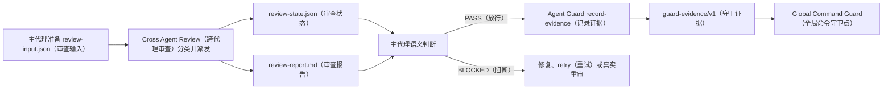

# Cross Agent Review（跨代理审查）稳定化与通用证据写入设计

## 1. 设计目标

本设计落实 OpenSpec（开放规格）中的四项能力变更：

1. 在 Cross Agent Review（跨代理审查）输入边界降低无关文档噪音。
2. 保存逐角色结果，只重试失败角色，并严格复用可机械证明的提交间变化。
3. 从 Cross Agent Review（跨代理审查）删除 Agent Guard（代理守卫）证据知识。
4. 在 Agent Guard Runtime（代理守卫运行时）提供主代理显式调用的通用 `record-evidence`（记录证据）。

OpenSpec（开放规格）差异规格仍是需求事实源；本文只定义实现结构、数据流、算法和测试落点。

## 2. 根因与边界

### 2.1 最上游根因

Cross Agent Review（跨代理审查）历史简化删除了 changed-file manifest（变更文件清单）和 path-scoped diff（路径限定差异），却让两个角色继续执行同一份无范围完整差异。Comet（双星工作流）生成大量规格、设计和计划文档只是放大这一缺陷；修 Comet（双星工作流）只能减少一个调用方的症状。

当前 SDK dispatch（开发包派发）虽然并发运行两个角色，但父进程只在整批返回后保存结果。外层超时或单角色异常会丢失已完成角色的可恢复边界。当前 `mark-pass`（标记通过）又把 Agent Guard（代理守卫）的画像编号、产物编号、证据路径和格式写进审查插件，形成所有权倒置。

### 2.2 保持不变

- Comet（双星工作流）的技能、阶段、脚本和状态推进不改。
- Cross Agent Review（跨代理审查）不判断 finding（发现项）是否放行。
- Planning Review（规划审查）保持只读。
- Agent Guard（代理守卫）不解析审查报告、不自主决定通过。
- 完整 `HEAD`（提交头）、12 位短提交目录和 `guard-evidence/v1`（守卫证据第一版）不变。
- 不新增第三方依赖、数据库、配置框架或新证据版本。

## 3. 总体结构



边界只有两条：Cross Agent Review（跨代理审查）负责事实，Agent Guard（代理守卫）负责证据契约；主代理是唯一语义决策者。

## 4. Cross Agent Review（跨代理审查）详细设计

### 4.1 文件改动保持集中

不创建新的运行时模块。实现继续位于现有 `cross_agent_review.py`（跨代理审查脚本），只更新现有 prompt template（提示词模板）、Skill（技能）说明和测试。脚本内新增小型数据结构与纯函数，避免为单一实现引入接口或工厂。

### 4.2 输入扩展

现有必填字段保持不变。新增两个可选数组：

```json
{
  "summary_only": [
    {
      "path": "docs/superpowers/plans/example.md",
      "reason": "过程计划只需供角色按需核对"
    }
  ],
  "revalidation_policy": [
    {
      "path": "docs/superpowers/plans/example.md",
      "validator": "checkbox-only"
    },
    {
      "path": "config/example.yaml",
      "validator": "mapping-fields-only",
      "format": "yaml",
      "fields": ["phase"]
    }
  ]
}
```

`path`（路径）必须是规范化项目相对 POSIX path（可移植路径），不能是绝对路径、不能包含 `..`，同一数组内不得重复。`summary_only.reason`（仅摘要理由）去除空白后必须非空。`mapping-fields-only`（仅映射字段）必须显式声明 `format: json|yaml` 和非空、无重复的顶层字段名；插件不通过扩展名猜格式。

### 4.3 单一文件清单

插件使用已有 Git（版本控制）命令能力执行：

```text
git diff --name-status -z --find-renames --find-copies-harder <base>...<head>
```

解析结果统一转换为项目相对 POSIX path（可移植路径）。每个已变更文件恰好分类一次：

| 条件 | 分类 | 主要行为 |
|---|---|---|
| 精确等于 `spec_file`、`design_file` 或 `plan_file` | `authoritative_context`（权威上下文） | 作为当前需求与设计依据 |
| 精确命中带理由的调用方声明 | `summary_only`（仅摘要） | 默认只显示状态、行数统计和理由，可按需展开 |
| 其他全部文件 | `full_review`（完整审查） | 进入路径限定完整差异 |

权威上下文的三个当前文件即使未变化，也会单独记录路径和 SHA-256（安全哈希），供角色读取和跨提交校验；`files`（文件清单）只记录 Git（版本控制）审查范围内的变更。

以下情况在派发前失败：

- 声明路径不在变更清单中。
- 同一路径重复或跨调用方分类重叠。
- 路径越出项目。
- Git（版本控制）返回无法解析的状态。

没有声明的文件永远回落到 `full_review`（完整审查），不会静默排除。

### 4.4 角色输入

新增内部 `_role-input`（角色输入）子命令；它不是用户工作流入口，仅供 reviewer prompt（审查代理提示词）调用：

```text
python cross_agent_review.py _role-input --input-file <review-input.json> --role <role>
```

该命令从派发前已写入的 `review-state.json`（审查状态文件）读取范围，不接受任意额外路径：

- 输出三个权威上下文路径和哈希。
- 输出 `summary_only`（仅摘要）的路径、理由、状态和 `numstat`（行数统计），不输出其完整差异。
- 通过 Python（脚本语言）参数数组执行 `git diff <base>...<head> -- <full_review paths...>`，输出限定差异。

`spec-alignment`（规格对齐）角色的提示词要求先读三份权威上下文，再核对限定差异；`implementation-correctness`（实施正确性）角色只把限定差异作为主要输入，必要时再读权威上下文或摘要文件。两个角色仍可主动读取摘要文件，因此 `summary_only`（仅摘要）不是豁免。

### 4.5 状态格式

默认只增加一个 `review-state.json`（审查状态文件），不增加默认 role result directory（角色结果目录）。角色 Markdown（标记文本）直接存入状态，debug（调试）模式继续使用现有原始文件机制。

```json
{
  "schema_version": "cross-agent-review-state/v1",
  "subject": {
    "change": "demo",
    "mode": "convergence",
    "base_ref": "<full sha>",
    "head_ref": "<full sha>",
    "head_ref_short": "<12 chars>",
    "input_file": ".local/.../review-input.json",
    "input_hash": "sha256:<hex>",
    "contexts": {
      "spec": {"path": "...", "hash": "sha256:<hex>"},
      "design": {"path": "...", "hash": "sha256:<hex>"},
      "plan": {"path": "...", "hash": "sha256:<hex>"}
    }
  },
  "files": [
    {
      "path": "src/example.py",
      "status": "M",
      "classification": "full_review",
      "reason": null
    }
  ],
  "roles": {
    "spec-alignment": {
      "scope": {
        "authoritative_context": ["..."],
        "full_review": ["..."],
        "summary_only": ["..."]
      },
      "attempts": [
        {
          "number": 1,
          "status": "completed",
          "started_at": "<UTC>",
          "finished_at": "<UTC>",
          "output": "# Review Result...",
          "output_hash": "sha256:<hex>"
        }
      ],
      "status": "completed",
      "output": "# Review Result...",
      "output_hash": "sha256:<hex>"
    }
  },
  "report_hash": "sha256:<hex>"
}
```

首次派发前先写入 subject（对象）、files（文件）和 role scope（角色范围）；此时角色 `status`（状态）省略。终态只使用 `completed`（完成）、`failed`（失败）、`timed_out`（超时）和 `reused`（复用）。

JSON（数据）写入使用标准库 `tempfile`（临时文件）在目标同目录创建文件，关闭文件后调用 `os.replace`（原子替换）；异常时清理临时文件。Windows（视窗系统）上不尝试替换仍打开的文件。

### 4.6 独立并发派发

保留现有 SDK（开发包）子进程隔离和内部 480 秒角色超时。父进程使用标准库 `ThreadPoolExecutor`（线程池）同时启动两个单角色 SDK（开发包）子进程，每个子进程沿用 540 秒上限。`as_completed`（按完成顺序）每取得一个角色结果，就由父进程更新状态；子进程不并发写同一文件。

单角色结果映射：

| 结果 | 状态 | 保存内容 |
|---|---|---|
| 非空 Markdown（标记文本） | `completed`（完成） | 原文及哈希 |
| SDK（开发包）异常、非 JSON（数据）或角色不匹配 | `failed`（失败） | CRITICAL（严重阻断）结果及哈希 |
| 内部或外层上限到期 | `timed_out`（超时） | CRITICAL（严重阻断）结果及哈希 |

两个角色达到终态后，从状态重建 `review-report.md`（审查报告）并写入 `report_hash`（报告哈希）。报告仍原样保留 reviewer（审查代理）文本，不解析发现项。

### 4.7 retry（重试）

用户入口：

```text
python cross_agent_review.py retry --input-file <review-input.json> [--sdk-python <path>]
```

重试前重新校验输入位置、完整 `HEAD`（提交头）、工作区、输入哈希和状态 subject（对象）。只选最新状态为 `failed`（失败）或 `timed_out`（超时）的角色；其 scope（范围）从状态读取，不允许命令行扩大。新尝试追加到 `attempts`（尝试记录），成功角色对象不重写。没有可重试角色时返回 `no_retryable_roles`，不启动 SDK（开发包）。

`retry`（重试）只处理运行故障。对语义 finding（发现项）的代码修复会产生新提交，应运行真实 `run`（运行）或满足严格条件的 `revalidate`（重新校验）。

### 4.8 revalidate（重新校验）

用户入口：

```text
python cross_agent_review.py revalidate \
  --input-file <current-review-input.json> \
  --previous-state <previous-review-state.json>
```

先验证复用来源：

- 上一状态路径与其 `change`（变更）和 12 位短提交一致。
- 上一输入文件、报告和两个角色输出哈希匹配。
- 两个上一角色必须都是 `completed`（完成），`reused`（复用）不得继续串联。
- 新旧 `change`、`mode`、`base_ref`、三份权威上下文路径和 `summary_only`（仅摘要）声明相同；只允许 `head_ref`（提交头）和当前复用策略变化。
- 当前工作区干净且当前完整 `HEAD`（提交头）等于新输入。

再比较 `<previous head>..<current head>`：

```text
git diff --name-status -z --find-renames --find-copies-harder <previous>..<current>
```

只接受普通修改 `M`。新增、删除、重命名、复制、类型变化和未合并状态全部拒绝。每个变化路径必须恰好匹配一条策略；`spec_file`（规格文件）或 `design_file`（设计文件）变化无条件拒绝。

#### checkbox-only（仅复选框）

通过 `git show <ref>:<path>` 读取两个提交的字节。要求 UTF-8（统一编码）文本、行数和换行结构相同。逐行只把 Markdown task checkbox（标记任务复选框）中的 `[ ]`、`[x]`、`[X]` 状态规范为同一值，再比较完整行；任何其他字符变化均拒绝。

#### mapping-fields-only（仅映射字段）

根据策略声明使用标准库 JSON（数据）解析器或仓库已经依赖的 PyYAML safe loader（安全配置加载器）。YAML（配置文件）加载器拒绝重复映射键。两端必须是字符串键的顶层 mapping（映射）；实际变化的顶层字段必须是声明字段的子集。删除声明字段后，两个解析结构必须完全相等。

全部通过时不加载 SDK（开发包），为当前短提交目录创建新状态和报告：复制上一角色原文，状态改为 `reused`（复用），并记录 `source_head_ref`（来源提交）、`source_state`（来源状态）、策略和变化文件。它不写 Agent Guard（代理守卫）证据；主代理仍需读取新报告后决定。

## 5. Agent Guard（代理守卫）详细设计

### 5.1 复用现有结构

不新增证据模块。把 `global_command_guards.py`（全局命令守卫脚本）已有的 artifact loader（产物加载器）和 safe path resolver（安全路径解析器）提升为同包可复用函数：

- 加载器返回以 artifact id（产物编号）索引的完整声明，而不只返回路径字符串。
- 现有 Global Command Guard（全局命令守卫点）读取路径改用完整声明中的 `path`。
- Runtime CLI（运行时命令行）复用同一加载器、模板渲染器和路径解析器。

这样只保留一份 `artifacts.yaml`（产物注册文件）和路径安全语义，不创建单实现抽象层。

### 5.2 命令接口

在现有 `guard_runtime/cli.py`（守卫运行时命令行）增加：

```text
record-evidence \
  --project <repo> \
  --user-home <home> \
  --profile-source project|user \
  --profile <profile-id> \
  --artifact <artifact-id> \
  --subject-type <type> \
  --subject-id <id> \
  --producer <producer> \
  --business-fields-file <json-file>
```

`profile`（画像编号）、`artifact`（产物编号）和 `subject-id`（对象编号）必须是单一路径段；`producer`（生产方）和 `subject-type`（对象类型）必须是非空字符串。命令不提供 `head_ref`（提交头）、证据路径或 status（状态）覆盖参数。

### 5.3 画像与路径校验

1. `profile-source`（画像来源）精确选择 `<project>/.agents/guards/<profile>` 或 `<user-home>/.agents/guards/<profile>`，不跨范围回退。
2. `artifacts.yaml`（产物注册文件）必须存在、可解析，且目标编号唯一。
3. 目标必须声明 `type: json`（数据类型）与 `owner: agent-guard`（代理守卫拥有）。其他 owner（所有者）一律视为外部产物，只读不写。
4. 路径只取目标声明，填入 `profile_id`、`artifact_id`、`subject_id`、当前 `git_head` 和 `git_head_short`。
5. 缺失模板变量、绝对路径、Windows drive path（Windows 驱动器路径）和项目根目录逃逸全部拒绝。证据始终相对当前项目解析，即使画像来自 user（用户）范围。

Guard Profile Validator（守卫画像校验器）同步增加静态检查：`owner: agent-guard`（代理守卫拥有）的产物必须是 JSON（数据）且使用默认路径：

```text
.local/guard/evidence/{profile_id}/{artifact_id}/{subject_id}/{git_head_short}/pass.json
```

外部产物的现有契约不变。

### 5.4 仓库与业务字段校验

命令执行 `git rev-parse HEAD`（读取提交头）和 `git status --porcelain=v1 -z --untracked-files=all`（读取工作区状态）。不是 Git（版本控制）仓库、空提交头或任何未忽略工作区变化都拒绝。业务字段文件必须是 UTF-8（统一编码）的顶层 JSON object（数据对象）。

保留字段：

```text
schema_version, status, producer, profile_id, artifact_id,
subject_type, subject_id, head_ref, head_ref_short, created_at
```

业务对象包含任一保留字段即拒绝，不能静默覆盖。通过后由 Runtime（运行时）注入：

```json
{
  "schema_version": "guard-evidence/v1",
  "status": "pass",
  "producer": "<caller>",
  "profile_id": "<profile>",
  "artifact_id": "<artifact>",
  "subject_type": "<type>",
  "subject_id": "<subject>",
  "head_ref": "<current full HEAD>",
  "head_ref_short": "<first 12 chars>",
  "created_at": "<UTC>"
}
```

业务字段随后合并。写入使用同目录临时文件加 `os.replace`（原子替换），允许主代理为同一当前提交显式重写完整证据。命令返回单行 JSON（数据），包含 `status: evidence_recorded`、完整提交头、短提交头和项目相对证据路径。

### 5.5 调用方业务字段

Cross Agent Review（跨代理审查）主代理从当前报告和状态构造现有兼容字段：

```json
{
  "change": "<change>",
  "mode": "<mode>",
  "base_ref": "<base>",
  "blocking_findings": 0,
  "scope": {
    "change": "<change>",
    "mode": "<mode>",
    "base_ref": "<base>",
    "state": ".local/.../review-state.json"
  },
  "report": ".local/.../review-report.md",
  "report_hash": "sha256:<report bytes hex>"
}
```

Planning Review（规划审查）主代理构造且仅构造五字段对象：`mode`（模式）、`scope`（范围）、`blocking`（阻断项）、`findings`（发现项）、`decision`（结论）。规范字节串等价于：

```python
json.dumps(review, ensure_ascii=False, sort_keys=True, separators=(",", ":")).encode("utf-8")
```

无尾随换行。业务字段包含原对象 `review`（审查结果），并设置 `blocking_findings: 0`、`scope: review["scope"]`、`report: "inline:review"`、`report_hash: "sha256:<lowercase hex>"`。Planning Review（规划审查）技能自身不写文件、不调用 Agent Guard（代理守卫）。

`record-evidence`（记录证据）不认识这些业务字段，也不验证审查结论；这些规则属于外部 Guard Profile（守卫画像）集成规格和主代理交接。

## 6. 删除与迁移

Cross Agent Review（跨代理审查）删除：

- `mark-pass`（标记通过）子命令。
- 默认画像、默认产物和默认对象类型常量。
- `guard_pass_path`（守卫通过路径）、`run_mark_pass`（运行标记通过）及其专用 clean-worktree allowlist（干净工作区允许清单）。
- Skill（技能）中具体 Agent Guard（代理守卫）路径、字段和命令说明。

调用 `mark-pass`（标记通过）将由 argparse（参数解析器）直接返回未知命令。现有 `pass.json`（通过标记）无需迁移，因为新入口保持相同路径和格式。仓库源码完成前不更新用户级安装；不会出现发布态双写版本。

## 7. 错误处理

所有拒绝均在启动 SDK（开发包）或写目标证据前发生，并输出稳定 reason token（原因标识）：

| 区域 | 主要原因标识 |
|---|---|
| 输入分类 | `invalid_summary_only`、`classification_overlap`、`path_outside_project` |
| 状态恢复 | `state_mismatch`、`input_hash_mismatch`、`output_hash_mismatch` |
| 重试 | `no_retryable_roles`、`retry_scope_mismatch` |
| 重新校验 | `reuse_policy_missing`、`unsupported_change_status`、`validator_failed`、`reused_source_not_allowed` |
| 证据写入 | `profile_not_found`、`artifact_not_found`、`artifact_not_guard_defined`、`unsafe_evidence_path`、`dirty_worktree`、`reserved_field_conflict` |

错误细节包含具体字段或路径，但不输出业务字段文件全文。临时文件写入失败时清理临时文件，原目标保持不变。

## 8. 测试策略

### 8.1 Cross Agent Review（跨代理审查）

在现有 `tests/test_cross_agent_review_cli.py`（跨代理审查命令测试）中先写失败测试，再实现：

- 三类分类、路径规范化、重复和越界拒绝。
- 两个角色 prompt（提示词）没有无范围完整差异。
- `_role-input`（角色输入）只展示精确限定差异和摘要统计。
- 一个角色先完成、另一个超时后，成功结果仍在状态中。
- `retry`（重试）只派发失败角色并追加尝试。
- 两个机械校验器的正例，以及每个拒绝边界。
- `revalidate`（重新校验）不调用 SDK（开发包）、生成当前提交的 `reused`（复用）报告和状态。
- `mark-pass`（标记通过）不再是合法命令。

### 8.2 Agent Guard（代理守卫）

在现有 Runtime（运行时）、Validator（校验器）和 package（包）测试中覆盖：

- project/user（项目/用户）画像来源精确选择。
- 产物 owner/type（所有者/类型）、默认路径和模板变量检查。
- Windows（视窗系统）绝对路径、驱动器路径和目录逃逸拒绝。
- 非 Git（版本控制）项目、脏工作区、保留字段冲突和非法业务 JSON（数据）拒绝。
- 原子覆盖不产生半文件。
- Global Command Guard（全局命令守卫点）继续读取新入口写出的同格式证据。

### 8.3 发布形态端到端回归

1. 通过 Cross Agent Review（跨代理审查）发布形态 CLI（命令行）生成报告和状态；模拟一个运行故障并只重试失败角色，或对允许变化执行 `revalidate`（重新校验）；主代理构造业务字段并调用 Agent Guard（代理守卫）发布形态 CLI（命令行）；最后从 hook router（钩子路由器）入口证明 Global Command Guard（全局命令守卫点）放行。
2. 从 Planning Review（规划审查）五字段结果构造规范哈希，调用同一个 `record-evidence`（记录证据），再从 hook router（钩子路由器）入口证明 design gate（设计门禁）放行。

最后运行 OpenSpec（开放规格）严格校验、两个插件定向测试、package verification（包完整性验证）和仓库 full verification（完整验证）。检查 Git diff（版本差异）确认没有修改 Comet（双星工作流）技能、脚本或用户级目录。

## 9. 明确不做

- 不自动识别“文档文件”或“Comet 文件”。
- 不为复用规则引入通用表达式、脚本或插件系统。
- 不新增 `guard-evidence/v2`（守卫证据第二版）。
- 不新增默认结果文件目录；状态文件已经足够恢复。
- 不在 Agent Guard（代理守卫）中实现报告解析、阻断项判断或哈希业务规则。
- 不在本变更中安装、同步、发布或提交用户级 Plugin（插件）与 Guard Profile（守卫画像）。
